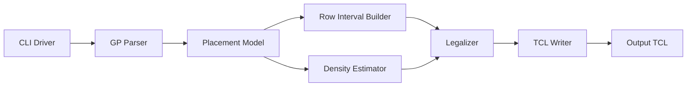

# Detailed Design

## Purpose

This document designs a C++17 placement legalizer for Programming Assignment #3, "Placement with OpenROAD." The program reads an OpenROAD-extracted `.gp` file, legalizes all movable standard cells, and writes an OpenROAD TCL script containing direct `place_cell` commands.

The implementation must satisfy the assignment flow:

```text
make
./Legalizer <alpha> <threshold> <input>.gp <output>.tcl
```

The generated TCL must place every movable cell inside the die, aligned to legal site rows, without overlap against other cells, fixed macros, or blockages. The generated TCL must not call `detailed_placement`, and every output command must keep orientation `R0`.

## Source Proposal Summary

The source proposal defines a compact C++17 command-line legalizer with these modules:

- CLI Driver
- GP Parser
- Placement Model
- Row Interval Builder
- Legalizer
- Density Estimator
- TCL Writer
- Test Fixtures

The legalizer keeps all internal geometry in database units (DBU), converts output origins to microns using `DBU_Per_Micron`, and optimizes the assignment quality metric:

```text
Quality = alpha * Average Displacement + (1 - alpha) * DOR
```

DOR is the percentage of non-macro 10 micron by 10 micron grids whose density exceeds the given threshold. The official `flow.tcl` remains the authoritative legality and quality evaluator.

## Design Goals

- Build a root-level `Legalizer` executable with `make`.
- Parse the `.gp` format emitted by `extract.tcl`.
- Preserve every movable `CELL` instance name and emit one `place_cell` command per movable cell.
- Keep all movable cells within the die, aligned to site rows, and non-overlapping.
- Treat `MACRO` and `BLOCKAGE` instances as fixed placement obstacles.
- Use `alpha` and `threshold` to balance displacement and density overflow during candidate scoring.
- Complete each benchmark within the assignment's 30 minute timeout.
- Keep modules independently testable with small fixture designs wherever possible.

## Non-Goals

- Do not call OpenROAD `detailed_placement` from generated output TCL.
- Do not rotate cells or change orientation.
- Do not modify LEF, DEF, OpenROAD database state, or helper scripts as part of normal legalization.
- Do not attempt to exactly duplicate OpenROAD GUI heatmap internals; density estimation is advisory.
- Do not require hidden benchmark-specific constants.

## Architecture Overview

The executable follows a parse, preprocess, legalize, and emit pipeline.



All geometry is represented in DBU until the TCL writer boundary. The row interval builder constructs legal row capacity from die bounds, site dimensions, fixed macros, and blockages. The legalizer places movable cells into those row intervals using a displacement and density-aware score. The density estimator tracks approximate 10 micron grid occupancy to guide placement away from congested regions.

## Module Designs

### CLI Driver

#### Responsibility

Own the process lifecycle. It validates command-line arguments, parses `alpha` and `threshold`, calls the parser, runs legalization, and writes the output TCL.

It does not interpret `.gp` records, perform geometry operations, place cells, or serialize individual placement commands.

#### Inputs and Outputs

Inputs:

- `argv[1]`: `alpha`, parsed as `double`.
- `argv[2]`: `threshold`, parsed as `double`.
- `argv[3]`: input `.gp` path.
- `argv[4]`: output `.tcl` path.

Outputs:

- Exit status `0` on success.
- Non-zero exit status on invalid arguments, file I/O failure, parse failure, impossible legalization, or output failure.
- Diagnostic messages on `stderr`.

Public interface:

```cpp
int main(int argc, char** argv);
```

#### Internal Design

1. Require exactly five arguments including the executable name.
2. Parse `alpha` and `threshold` with full-string numeric validation.
3. Construct parser input path and writer output path from the user-provided arguments without renaming them.
4. Call `GpParser::parse`.
5. Call `RowIntervalBuilder::build`.
6. Construct `DensityEstimator`.
7. Call `Legalizer::legalize`.
8. Call `TclWriter::write`.

The driver catches module-level exceptions or error results and converts them into concise diagnostics and a non-zero exit code.

#### Dependencies

- GP Parser
- Placement Model
- Row Interval Builder
- Density Estimator
- Legalizer
- TCL Writer
- Standard C++ file and numeric parsing utilities

#### Failure Handling

- Invalid argument count: print usage and return non-zero.
- Invalid numeric arguments: print which argument failed and return non-zero.
- Any module failure: print the module-provided error and return non-zero.
- Partial output file behavior is an implementation detail; the writer should report failure if the output stream cannot be completed.

#### Independent Test Plan

- Run the executable with missing arguments and verify non-zero exit.
- Run with invalid `alpha` or `threshold` strings and verify non-zero exit.
- Run with an unreadable input path and verify non-zero exit.
- Use a tiny valid `.gp` fixture and verify the output TCL is created.

Known command:

```sh
make
./Legalizer 0.7 45 fixture.gp fixture.tcl
```

#### Open Questions

None.

### GP Parser

#### Responsibility

Read the assignment `.gp` text format and populate a typed placement model. The parser owns syntax validation and type classification only.

It does not legalize coordinates, snap to rows, subtract obstacles, estimate density, or write TCL.

#### Inputs and Outputs

Input:

- A text file in the format emitted by `extract.tcl`.

Output:

- `Design` object containing:
  - `dbu_per_micron`
  - `die_area`
  - `site_width`
  - `site_height`
  - ordered movable cells
  - fixed obstacles
  - original instance geometry

Expected metadata records:

```text
DBU_Per_Micron <integer>
DieArea_LL <x> <y>
DieArea_UR <x> <y>
Site_Width <integer>
Site_Height <integer>
```

Expected instance header:

```text
Name LLX LLY Width Height Type
```

Expected instance row:

```text
<instName> <lowerleftX> <lowerleftY> <cellWidth> <cellHeight> <cellType>
```

`CELL` records become movable cells. `MACRO` and `BLOCKAGE` records become fixed obstacles.

#### Internal Design

1. Read metadata lines in the required order.
2. Skip blank lines until the instance header.
3. Validate the header tokens exactly enough to catch malformed input.
4. Parse every instance row into a typed record.
5. Store all coordinates, widths, and heights as signed 64-bit DBU integers.
6. Reject non-positive DBU scale, site dimensions, or instance dimensions.
7. Preserve input order for movable cells so output ordering is deterministic.

The parser should allow obstacle coordinates outside the die because the sample PDF shows blockages such as negative lower-left X. The row interval builder will clip obstacle effects to the die.

#### Dependencies

- Placement Model
- Standard C++ streams and string parsing

#### Failure Handling

- Missing metadata: parse failure.
- Invalid integer field: parse failure with line context.
- Unknown type: parse failure unless the implementation explicitly chooses to treat unknown non-`CELL` types as fixed obstacles. The proposal does not specify unknown type behavior, so strict rejection is the design.
- Duplicate names are not resolved by this module; if present, they should be reported as a model validation failure before writing TCL.

#### Independent Test Plan

- Parse a minimal one-cell `.gp` fixture.
- Parse fixtures containing `CELL`, `MACRO`, and `BLOCKAGE`.
- Verify a blank line before the header is accepted.
- Verify malformed metadata, missing header, bad integers, non-positive dimensions, and unknown types fail.
- Verify an obstacle partially outside the die is accepted by the parser.

Candidate target:

```sh
make test
```

#### Open Questions

None.

### Placement Model

#### Responsibility

Provide shared typed data structures for geometry, design metadata, movable cells, fixed obstacles, final placements, and common geometry helpers.

It does not perform file parsing, candidate search, density policy, or output formatting.

#### Inputs and Outputs

Inputs:

- Parsed metadata and instance records from the GP Parser.

Outputs:

- Immutable original placement fields for each instance.
- Mutable final placement fields for movable cells after legalization.
- Geometry helpers used by row, legalizer, density, and writer modules.

Core data structures:

```cpp
struct Rect {
    int64_t x_min;
    int64_t y_min;
    int64_t x_max;
    int64_t y_max;
};

enum class InstanceType {
    Cell,
    Macro,
    Blockage
};

struct Cell {
    std::string name;
    Rect original;
    Rect placed;
    bool has_placement;
};

struct Obstacle {
    std::string name;
    Rect rect;
    InstanceType type;
};

struct Design {
    int64_t dbu_per_micron;
    Rect die;
    int64_t site_width;
    int64_t site_height;
    std::vector<Cell> cells;
    std::vector<Obstacle> obstacles;
};
```

#### Internal Design

Geometry conventions:

- Rectangles use half-open intervals: `[x_min, x_max) x [y_min, y_max)`.
- Width is `x_max - x_min`.
- Height is `y_max - y_min`.
- Two rectangles overlap only when their half-open interiors intersect.
- Site snapping is relative to `die.x_min` and `die.y_min`.

Helpers:

- `width(Rect)`, `height(Rect)`
- `intersects(Rect, Rect)`
- `contains(outer, inner)`
- `clip(Rect, Rect)`
- `snapDownToSiteX(x)`
- `snapUpToSiteX(x)`
- `rowIndexForY(y)`
- `rowY(row_index)`

The model should keep original global placement coordinates even after legalization so displacement can be calculated and debugging output can compare original and final positions.

#### Dependencies

- Standard C++ containers and strings

#### Failure Handling

- Model validation should reject invalid die dimensions, site dimensions, duplicate cell names, and cell heights that cannot fit any legal row under the chosen single-row design.
- The assignment examples show standard cells with height equal to site height. If multi-height cells appear, they require explicit support in the row interval builder and legalizer.

#### Independent Test Plan

- Unit-test rectangle overlap edge cases.
- Unit-test clipping obstacles against the die.
- Unit-test site snapping for coordinates already on site, between sites, and outside die bounds.
- Unit-test duplicate name detection.

#### Open Questions

- The proposal assumes standard cells fit site rows. If hidden cases include multi-height cells, should the legalizer support stacked row occupancy or fail explicitly? The assignment text says standard cells aligned with site rows, but does not state whether all movable cells are single-height.

### Row Interval Builder

#### Responsibility

Construct legal horizontal placement intervals for each site row by subtracting fixed macro and blockage spans from the die.

It does not place movable cells or evaluate density quality.

#### Inputs and Outputs

Inputs:

- `Design::die`
- `Design::site_width`
- `Design::site_height`
- fixed `MACRO` and `BLOCKAGE` rectangles

Output:

```cpp
struct RowInterval {
    int64_t x_min;
    int64_t x_max;
};

struct LegalRow {
    int64_t y;
    std::vector<RowInterval> free_intervals;
};

std::vector<LegalRow>
```

Each interval is clipped to the die and snapped inward to site-aligned X coordinates. A cell of width `w` may start at site-aligned `x` if `x >= interval.x_min` and `x + w <= interval.x_max`.

#### Internal Design

1. Compute row count from die height and site height:

   ```text
   row_count = floor((die.y_max - die.y_min) / site_height)
   ```

2. Initialize each row with one interval covering the die X span snapped to site boundaries.
3. For each fixed obstacle:
   - Clip it to the die.
   - Find rows whose vertical span intersects the obstacle.
   - Subtract the obstacle's horizontal span from each intersecting row.
   - Snap the resulting interval boundaries inward to legal site coordinates.
4. Remove intervals shorter than one site width.
5. Merge adjacent intervals only when they are truly contiguous and site-aligned.

Obstacle subtraction is conservative. If a macro overlaps any part of a row's vertical extent, its X span is removed from that row.

#### Dependencies

- Placement Model geometry helpers

#### Failure Handling

- Empty row set: fail legalization.
- No free intervals in any row: fail legalization.
- Overflow or invalid geometry: report row build failure.

#### Independent Test Plan

- Build rows for an empty die and verify full-width intervals.
- Subtract one macro fully inside one row.
- Subtract a blockage spanning all rows at the left die edge.
- Subtract an obstacle partially outside the die and verify clipping.
- Verify interval boundaries are snapped inward and remain legal for site starts.

#### Open Questions

None.

### Legalizer

#### Responsibility

Assign final legal coordinates to every movable cell. It owns placement ordering, candidate generation, legality checks against already placed cells, and committing placements.

It does not parse input, build fixed-obstacle intervals, compute authoritative OpenROAD DOR, or write TCL.

#### Inputs and Outputs

Inputs:

- Movable cells with original global-placement coordinates.
- Legal rows and free intervals.
- `alpha`
- `threshold`
- Density estimator instance.

Outputs:

- Final `placed` rectangle for every movable cell.
- `has_placement = true` for every movable cell.

Candidate contract:

```cpp
struct Candidate {
    size_t row_index;
    int64_t x;
    int64_t y;
    double displacement_cost;
    double density_cost;
    double total_cost;
};
```

#### Internal Design

The legalizer uses greedy row-based candidate search with deterministic fallback expansion.

Placement order:

1. Prefer harder cells first:
   - Larger area first.
   - Fewer nearby legal row candidates first if cheaply available.
   - Stable tie-break by original Y, then original X, then input order.
2. Preserve deterministic behavior for reproducible debugging.

Candidate row generation:

1. Compute the nearest legal row to the original Y.
2. Search rows in increasing vertical distance from original Y.
3. Expand until enough feasible candidates are found or all rows have been considered.

Candidate X generation:

1. For each free interval in the candidate row, clamp the original X to legal start range:

   ```text
   start_min = interval.x_min
   start_max = interval.x_max - cell_width
   ```

2. Snap the clamped X to nearby site starts.
3. Evaluate a bounded set of starts around the preferred X, then expand left and right by site width.
4. Maintain occupied segments per row so overlap against already placed cells is checked without scanning all placed cells.

Commit behavior:

1. Reject candidates outside the die.
2. Reject candidates that do not fit inside a free fixed-obstacle interval.
3. Reject candidates overlapping already occupied row segments.
4. Score feasible candidates.
5. Insert the chosen segment into the row occupancy structure.
6. Update the density estimator with the chosen rectangle.

Scoring:

```text
displacement = (abs(x - original_x) + abs(y - original_y)) / dbu_per_micron
density_penalty = DensityEstimator::score(rect)
total = alpha * normalized_displacement + (1 - alpha) * density_penalty
```

The assignment's `flow.tcl` multiplies average displacement by `18.2` before combining it with DOR. The legalizer may use the same scale in candidate scoring so displacement and density penalties are closer to the official quality calculation.

Fallback strategy:

- If bounded local search finds no feasible candidate, search every interval in every row for the nearest legal start.
- If a cell still cannot be placed, return failure with the cell name and dimensions.

#### Dependencies

- Placement Model
- Row Interval Builder output
- Density Estimator
- Standard C++ ordered containers or sorted vectors for row occupancy

#### Failure Handling

- If any cell cannot fit in any row interval, fail with an explicit message.
- If row occupancy insertion detects an overlap, treat it as an internal error and fail.
- If density scoring overflows grid indexing bounds, treat the density contribution as high cost and keep legality checks authoritative.

#### Independent Test Plan

- Legalize one cell in an empty one-row design.
- Legalize adjacent cells without overlap.
- Legalize around a fixed macro that splits a row.
- Legalize a cell whose original coordinate is outside legal intervals due to blockage.
- Verify all placements are site-aligned and inside the die.
- Verify deterministic output for the same fixture and parameters.
- Verify failure on an intentionally overfull fixture.

Candidate commands:

```sh
make test
./Legalizer 0.7 45 small.gp small.tcl
```

#### Open Questions

- The exact placement ordering and candidate expansion limits affect quality but not correctness. The design chooses a deterministic greedy strategy; tuning values should be treated as implementation parameters and validated with `flow.tcl`.

### Density Estimator

#### Responsibility

Track approximate 10 micron by 10 micron grid occupancy and provide candidate density penalties to the legalizer.

It does not decide legality, and it is not the authoritative DOR calculator.

#### Inputs and Outputs

Inputs:

- Die area in DBU.
- `dbu_per_micron`.
- `threshold`.
- Fixed macro rectangles.
- Committed movable-cell rectangles.

Outputs:

- Candidate density cost.
- Updated occupancy state after a placement is committed.
- Optional debug statistics for estimated overflow grids.

Grid contract:

```text
grid_size_dbu = 10 * dbu_per_micron
```

Each grid stores:

- total grid area in DBU squared
- fixed macro-covered area
- movable occupied area
- whether the grid is excluded because it is fully covered by fixed macros, if practical to determine

#### Internal Design

1. Create a 2D grid covering the die.
2. Preload fixed macro occupancy into macro area counters.
3. Optionally preload blockage occupancy as unavailable area for scoring, while remembering that the assignment's DOR exclusion specifically mentions fixed macros.
4. For a candidate movable rectangle:
   - Identify intersected grids.
   - Compute added area per grid using rectangle intersection.
   - Estimate resulting density for each non-excluded grid.
   - Penalize grids above `threshold`.
5. On commit, add the rectangle's area to movable occupancy.

Penalty model:

```text
overflow = max(0, estimated_density - threshold)
penalty = sum(overflow weighted by affected grid area)
```

The penalty should be normalized to a 0 to 100-ish scale where practical, because official DOR is reported as a percentage.

#### Dependencies

- Placement Model geometry helpers

#### Failure Handling

- If the grid would be unexpectedly huge, use a sparse map keyed by grid coordinates instead of dense allocation.
- If a rectangle touches no grid due to invalid geometry, return a high penalty and let the legalizer's geometry validation fail if needed.

#### Independent Test Plan

- Verify grid size equals `10 * dbu_per_micron`.
- Add one cell completely inside one grid and verify density rises.
- Add one cell crossing grid boundaries and verify area is split.
- Verify a fully macro-covered grid is excluded when computing estimated overflow.
- Verify candidate scoring increases after a grid crosses `threshold`.

#### Open Questions

- `flow.tcl` removes instances whose names match `h*` before dumping the heatmap. The assignment says fixed macro regions are excluded from DOR. The estimator should prioritize macro exclusion, but exact OpenROAD heatmap behavior may differ.

### TCL Writer

#### Responsibility

Serialize legalized movable-cell placements into an OpenROAD TCL script.

It does not compute or change placement coordinates.

#### Inputs and Outputs

Inputs:

- `Design::dbu_per_micron`
- Movable cells with final `placed` rectangles
- Output path

Output:

- Text file containing one command per movable cell:

```tcl
place_cell -inst_name <instName> -orient R0 -origin {X Y}
```

`X` and `Y` are lower-left origins in microns.

#### Internal Design

1. Open the output path for writing.
2. Iterate movable cells in deterministic input order.
3. Validate `has_placement`.
4. Convert DBU to microns:

   ```text
   micron = dbu / DBU_Per_Micron
   ```

5. Format values without unnecessary trailing noise while preserving exact site multiples when possible.
6. Escape or validate instance names for TCL safety. The assignment examples use plain names; if names contain special Tcl characters, braced `-inst_name` values may be safer if accepted by OpenROAD.
7. Never emit `detailed_placement`.

#### Dependencies

- Placement Model
- Standard C++ output streams

#### Failure Handling

- Unplaced cell: writer failure.
- Invalid DBU scale: writer failure.
- Cannot open or flush output file: writer failure.

#### Independent Test Plan

- Write one placed cell and compare exact TCL command shape.
- Verify DBU-to-micron conversion with `DBU_Per_Micron 1000`.
- Verify writer rejects unplaced cells.
- Verify output does not contain `detailed_placement`.

#### Open Questions

- If hidden benchmark instance names contain Tcl-special characters, confirm whether `place_cell -inst_name {name}` is accepted. The public examples appear compatible with unbraced names.

### Test Fixtures

#### Responsibility

Provide small independent tests for parser, model geometry, row interval construction, density scoring, writer formatting, and simple legalizer behavior.

It does not replace full OpenROAD validation through `flow.tcl`.

#### Inputs and Outputs

Inputs:

- Small hand-written `.gp` fixture files.
- In-memory model fixtures for geometry-heavy modules.

Outputs:

- Pass/fail result through `make test`.
- Optional generated temporary TCL files for writer tests.

#### Internal Design

Use lightweight C++ tests that can compile with the same C++17 toolchain as the legalizer. Keep fixture designs small enough to inspect manually:

- One empty-row legal placement case.
- One fixed macro splitting a row.
- One blockage at the die boundary.
- One overfull row failure case.
- One density threshold case.

Tests should prefer module APIs rather than invoking the full executable, except for a small end-to-end smoke test.

#### Dependencies

- Public module headers
- Makefile `test` target

#### Failure Handling

- Tests should fail fast with the specific checked condition.
- Generated temporary files should be single explicit files if cleanup is needed.

#### Independent Test Plan

Run:

```sh
make test
```

The README describes `tests/test_legalizer` as the intended test binary.

#### Open Questions

None.

## Cross-Module Contracts

- All internal coordinates and dimensions are signed 64-bit DBU integers.
- Rectangles use half-open intervals.
- `CELL` is movable; `MACRO` and `BLOCKAGE` are fixed obstacles.
- The parser preserves input order for movable cells.
- The row interval builder clips fixed obstacles to the die before subtracting their spans.
- The legalizer is the only module that mutates final cell placements.
- The density estimator may influence candidate score, but legality is enforced by row intervals and row occupancy.
- The writer emits only movable `CELL` placements.
- The writer converts DBU to microns only at output time.
- Every output command uses `-orient R0`.
- Generated TCL must not contain `detailed_placement`.

## Test Strategy

Module tests:

- Parser fixtures for valid and invalid `.gp` files.
- Geometry tests for overlap, containment, clipping, and snapping.
- Row interval tests for macro and blockage subtraction.
- Legalizer tests for simple legal placement, obstacle avoidance, deterministic output, and overfull failure.
- Density estimator tests for grid area accounting and threshold penalties.
- Writer tests for command shape, unit conversion, and unplaced-cell rejection.

Integration tests:

```sh
make
./Legalizer 0.7 45 <designName>_insts.gp <designName>_insts.tcl
```

OpenROAD validation with public benchmarks:

```tcl
set caseName "public/ispd19_sample"
set alpha 0.7
set threshold 45
source flow.tcl
```

Repeat with both public benchmark folders and at least two parameter configurations:

- Displacement-heavy run with higher `alpha`.
- Density-heavy run with lower `alpha`.

Acceptance checks:

- `check_placement -verbose` reports legality pass.
- No cell overlaps.
- No placement outside the die.
- All cells are site-row aligned.
- All emitted orientations are `R0`.
- Output TCL contains no `detailed_placement`.
- Runtime is below 30 minutes per benchmark.
- `flow.tcl` prints total displacement, average displacement, DOR, normalized displacement, and final quality score.

## Risks and Mitigations

| Risk | Impact | Mitigation |
| --- | --- | --- |
| Greedy placement blocks later cells. | Legalization failure or high displacement. | Place harder cells earlier and provide all-row fallback search. |
| Candidate search is too narrow. | Missed legal placements. | Expand from local search to exhaustive row-interval fallback. |
| Approximate density differs from OpenROAD heatmap. | Lower quality ranking. | Keep density advisory and tune with public `flow.tcl` results. |
| Fixed obstacles partially overlap rows. | Illegal placement against macros or blockages. | Subtract obstacle spans conservatively from every intersected row. |
| Unit conversion mistakes. | OpenROAD places cells incorrectly. | Keep DBU internally and convert only in the writer; unit-test conversion. |
| Multi-height cells appear. | Single-row occupancy model may be insufficient. | Detect unsupported heights early or extend row occupancy across all covered rows. |
| Large density grids consume memory. | Runtime or memory failure. | Use sparse occupancy if dense grid dimensions are too large. |
| Tcl-special instance names. | Output script parse errors. | Validate names and, if confirmed compatible, brace names in `place_cell`. |

## Open Questions

- Should hidden cases with movable cells taller than one site row be supported by multi-row placement, or may the implementation reject them as unsupported? The proposal assumes standard cells are single-row, but the PDF does not explicitly state all movable cells have height equal to `Site_Height`.
- Should `-inst_name` values be emitted raw as in the assignment sample, or braced to guard against Tcl-special characters if OpenROAD accepts braced instance names?
- Should blockages contribute to density exclusion in the estimator, or only to legality? The grading text explicitly excludes fixed macros from DOR grid count, while blockages are fixed obstacles for legality.
