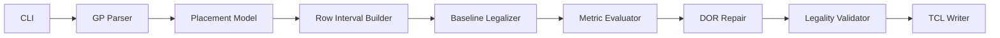

# High-Level Design

## Overview

The project will implement a standalone C++17 placement legalizer named
`Legalizer`. The executable reads an OpenROAD-extracted `.gp` placement file,
legalizes all movable single-row standard cells onto legal site rows while
avoiding fixed macros and blockages, and writes an OpenROAD TCL script
containing only explicit `place_cell` commands.

The authoritative `.gp` input contract is the format emitted by
`extract_v2.tcl`. The program interface is:

```sh
./Legalizer <alpha> <threshold> <input.gp> <output.tcl>
```

The legalizer prioritizes correctness first: it must produce only legal
placements, reject unsupported multi-row movable cells with a clear diagnostic,
and validate the final placement before writing output. Quality is improved by
combining obstacle-aware Abacus-style legalization with DOR-aware local repair.

## Goals

- Parse the `.gp` format emitted by `extract_v2.tcl`.
- Place every movable single-row `CELL` instance inside the die area.
- Align every movable cell to legal placement sites and rows.
- Avoid overlap among movable cells, fixed `MACRO` rectangles, and `BLOCKAGE`
  rectangles.
- Preserve each cell's original orientation and avoid cell rotation.
- Emit an OpenROAD TCL script containing fixed-precision `place_cell` commands
  only.
- Optimize the assignment quality metric:

```text
Quality = alpha * AverageDisplacement + (1 - alpha) * DOR
```

- Include DOR-aware repair in the initial architecture, not as an optional later
  extension.

## Non-Goals

- The tool will not call or emit OpenROAD `detailed_placement`.
- The initial implementation will not legalize multi-row movable cells. It will
  detect and reject them by name.
- The tool will not implement a full global placer.
- Parallel legalization is not required for the initial design.
- Network-flow legalization is not part of the initial design.

## Requirements Summary

| Area | Requirement |
| --- | --- |
| Executable | Build `Legalizer` in the repository root. |
| Language | C++17 on Linux. |
| CLI | `./Legalizer <alpha> <threshold> <input.gp> <output.tcl>`. |
| Input | `.gp` generated by `extract_v2.tcl`. |
| Output | OpenROAD TCL with explicit `place_cell` commands only. |
| Legality | Die containment, site alignment, row alignment, no overlaps, no rotation. |
| Obstacles | Treat fixed `MACRO` and `BLOCKAGE` records as rectangular obstacles. |
| Movable cells | Support single-row `CELL` instances; reject multi-row movable cells. |
| Quality | Minimize weighted average displacement and density overflow ratio. |
| Density grid | Evaluate DOR on 10 um by 10 um grids with macro-covered grids excluded. |
| Validation | Run internal legality checks before output is written. |

## Proposed Architecture

The executable is organized as a pipeline. Each stage owns one part of the
placement contract and passes structured data to the next stage.



The baseline legalizer uses obstacle-aware row intervals and Abacus cluster
packing to minimize displacement. A Tetris-style nearest-feasible insertion path
acts as the legality-preserving fallback when an Abacus trial cannot find a
placement. After a complete legal placement exists, the DOR repair phase makes
bounded local moves, swaps, and reinsertions that preserve legality and improve
the final weighted metric.

## Modules

| Module | Responsibility | Inputs | Outputs | Dependencies |
| --- | --- | --- | --- | --- |
| CLI / Main | Validate arguments, invoke the pipeline, report diagnostics. | `alpha`, `threshold`, input path, output path. | Exit code, final output file request. | Parser, legalizer, writer. |
| GP Parser | Parse `extract_v2.tcl` `.gp` records into typed objects. | `.gp` text. | Technology data, die bounds, cells, obstacles. | Placement model. |
| Placement Model | Own canonical geometry and placement state. | Parsed records. | Normalized DBU geometry, movable/fixed object lists. | None. |
| Row Interval Builder | Split die rows into obstacle-free legal intervals. | Die, site dimensions, fixed rectangles. | Row intervals with site-aligned capacity. | Placement model. |
| Baseline Legalizer | Produce the first complete legal placement. | Movable cells, row intervals. | Legal cell coordinates. | Row interval builder, Abacus row solver, Tetris fallback. |
| Abacus Row Solver | Repack one interval after tentative insertion. | Ordered cells in one interval. | Non-overlapping site-aligned x positions. | Placement model. |
| Tetris Fallback | Find a nearest feasible legal gap when Abacus fails. | Cell, candidate intervals. | Legal cell coordinate. | Row intervals. |
| Metric Evaluator | Compute average displacement, DOR, and weighted quality. | Placement state, `alpha`, `threshold`. | Metric values and local delta estimates. | Placement model. |
| DOR Repair | Improve density overflow while preserving legality. | Legal placement, metrics, row intervals. | Improved legal placement. | Metric evaluator, Abacus row solver. |
| Legality Validator | Reject invalid placements before output. | Final placement state. | Success or diagnostic list. | Placement model, row intervals. |
| TCL Writer | Emit fixed-precision OpenROAD `place_cell` commands. | Validated placement. | Output TCL file. | Placement model. |
| Tests | Validate parser, geometry, row splitting, legalization, metrics, and output. | Synthetic fixtures and public cases. | Pass/fail diagnostics. | All modules. |

## Module Relationships

The GP Parser creates the initial Placement Model from the file format emitted
by `extract_v2.tcl`. The Row Interval Builder reads fixed geometry from the
Placement Model and creates legal row intervals by projecting each macro or
blockage onto every overlapping row.

The Baseline Legalizer owns initial cell assignment. It tests candidate
intervals near each cell's original y-coordinate, uses the Abacus Row Solver to
score tentative insertions, and commits the lowest-cost legal candidate. If no
candidate succeeds through Abacus, it asks the Tetris Fallback for the nearest
available legal gap.

The Metric Evaluator reads the legal placement and computes assignment metrics.
The DOR Repair module uses those metrics to choose overflow-driven local moves,
swaps, and reinsertions. Each accepted repair updates the Placement Model and
the affected row intervals.

The Legality Validator is the gate before persistence. The TCL Writer runs only
after validation succeeds.

## Data Flow

1. CLI receives `alpha`, `threshold`, `input.gp`, and `output.tcl`.
2. GP Parser reads DBU per micron, die bounds, site width, site height, and all
   placement objects.
3. Placement Model stores coordinates internally in database units.
4. Unsupported multi-row movable cells are detected and reported before
   legalization.
5. Row Interval Builder creates one row per legal site row and splits rows around
   fixed macros and blockages.
6. Baseline Legalizer produces a complete legal placement with Abacus insertion
   and Tetris fallback.
7. Metric Evaluator computes average displacement and initial DOR.
8. DOR Repair runs bounded local improvement passes that preserve legality and
   improve the weighted metric or reduce DOR without unacceptable displacement
   cost.
9. Legality Validator checks the final placement.
10. TCL Writer converts DBU coordinates to microns and writes fixed-precision
    `place_cell` commands.

## Interfaces and Contracts

### `.gp` Input Contract

The parser expects the `extract_v2.tcl` structure:

```text
DBU_Per_Micron <integer>
DieArea_LL <x> <y>
DieArea_UR <x> <y>
Site_Width <integer>
Site_Height <integer>

Name LLX LLY Width Height Orient Type
<name> <llx> <lly> <width> <height> <orient> CELL
<name> <llx> <lly> <width> <height> <orient> MACRO
<name> <llx> <lly> <width> <height> BLOCKAGE
```

`CELL` records are movable. `MACRO` and `BLOCKAGE` records are fixed obstacles.
`BLOCKAGE` records may omit orientation because `extract_v2.tcl` emits only
six fields for them.

### Legalization Contract

The legalizer must assign each supported movable cell exactly one coordinate.
Coordinates are lower-left origins in DBU. Each x-origin must be aligned to the
site width, and each y-origin must match a legal row y-coordinate. Cells must
remain inside the die and must not overlap other movable cells or fixed
obstacles.

### Output Contract

The writer emits one command per movable cell:

```tcl
place_cell -inst_name <instName> -orient <orient> -origin {<xMicron> <yMicron>}
```

Coordinates are converted from DBU to microns and emitted with fixed decimal
precision. The output must not contain `detailed_placement`.

### Metric Contract

Average displacement is computed from original to final lower-left coordinates.
DOR is computed on 10 um by 10 um grids using the supplied `threshold`; grids
covered by fixed macros are excluded from the denominator.

## Operational Considerations

- The implementation should be deterministic so repeated grading runs produce
  stable output.
- Runtime must remain comfortably below the assignment's 30-minute limit.
- DOR repair should use fixed iteration limits and stop after a full pass with
  no accepted moves.
- The writer should avoid replacing the requested output with invalid contents;
  output is written only after successful validation.
- Diagnostics should identify malformed input, unsupported multi-row cells, and
  legality failures with enough detail to debug the benchmark.

## Risks and Tradeoffs

| Risk | Impact | Mitigation |
| --- | --- | --- |
| Multi-row cells appear in hidden benchmarks. | The tool will reject instead of legalizing them. | This is an explicit project decision; diagnostics must name the unsupported cell. |
| Density repair hurts displacement-heavy configurations. | Quality may worsen when `alpha` is high. | Accept only moves that improve weighted quality or reduce DOR within a bounded displacement penalty. |
| DOR differs from OpenROAD heatmap behavior. | Local decisions may optimize an approximation. | Match the assignment definition as closely as possible and validate with public OpenROAD flow. |
| Row interval edge cases around obstacles. | Illegal overlap or lost placement capacity. | Unit-test obstacle splitting for boundary, full-row, and multi-row cases. |
| Fixed decimal output precision is too low. | OpenROAD may round placements unexpectedly. | Use enough fixed precision to preserve DBU-to-micron conversion accurately for site alignment. |

## Validation Plan

1. Unit-test parsing for technology headers, `CELL`, `MACRO`, and six-field
   `BLOCKAGE` records.
2. Unit-test multi-row movable cell rejection.
3. Unit-test row interval splitting for no-overlap, partial overlap, full-row
   blockage, row-boundary contact, and multi-row obstacle coverage.
4. Unit-test Abacus row packing on small known cell sequences and interval
   bounds.
5. Unit-test Tetris fallback placement into available gaps.
6. Unit-test legality validation for die overflow, off-site placement, off-row
   placement, movable overlap, obstacle overlap, and missing placement.
7. Unit-test DOR calculation on hand-computable 10 um grids with macro-covered
   grids excluded.
8. Unit-test TCL output for fixed decimal coordinates, orientation preservation,
   and absence of `detailed_placement`.
9. Smoke-test the required CLI:

```sh
make
./Legalizer <alpha> <threshold> <input.gp> <output.tcl>
```

10. Run the OpenROAD helper flow on the public benchmarks and verify that
    `check_placement -verbose` passes after sourcing the generated TCL.

## Confirmed Design Decisions

- Multi-row movable cells are rejected with clear diagnostics instead of
  supported by the initial legalizer.
- DOR-aware repair is included in the initial architecture.
- TCL output coordinates use fixed decimal micron precision.
- `extract_v2.tcl` is the authoritative source for the `.gp` input format.

## Open Questions

No design-blocking questions remain for the high-level design.
