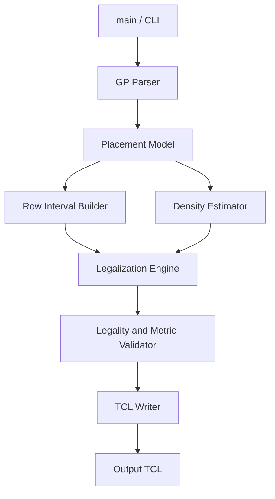

# High-Level Design

## Overview

This project builds a standalone C++17 placement legalizer for Programming Assignment #3, "Placement with OpenROAD." The executable is invoked as:

```sh
./Legalizer <alpha> <threshold> <input>.gp <output>.tcl
```

The legalizer reads the OpenROAD-extracted `.gp` model, moves all movable `CELL` instances onto legal site rows, avoids all `MACRO` and `BLOCKAGE` rectangles, validates the result, and writes explicit OpenROAD `place_cell` commands. The output TCL must not call `detailed_placement`, and movable cells must retain orientation `R0`.

The proposed architecture follows the existing `Makefile` module boundaries: placement model, `.gp` parser, row interval builder, density estimator, legalization engine, TCL writer, and executable entry point. The main legalization strategy is Abacus-style row assignment and cluster placement, with density-aware candidate scoring and bounded local repair.

## Goals

- Produce legal placements for the public and hidden OpenROAD benchmark cases within 30 minutes per benchmark.
- Minimize the assignment quality function:

  ```text
  Quality = alpha * Average_Displacement + (1 - alpha) * DOR
  ```

- Honor the required executable interface and Linux C++17 build flow.
- Generate only explicit `place_cell` commands in the output TCL.
- Use integer DBU geometry internally to avoid coordinate drift.
- Support robust single-row standard-cell legalization and clearly reject unsupported multi-row movable cells unless multi-row support is later implemented.
- Validate legality and metrics before replacing the requested output file.

## Non-Goals

- Do not invoke OpenROAD `detailed_placement` from generated TCL.
- Do not rotate movable cells.
- Do not depend on external libraries beyond the C++17 standard library.
- Do not optimize routing, timing, pin access, or wirelength except indirectly through displacement and density.
- Do not implement full mixed-cell-height legalization in the initial design unless hidden-case requirements force that scope change.

## Requirements Summary

| Area | Requirement |
| --- | --- |
| Build | `make` builds `Legalizer` using Linux-compatible C++17. |
| CLI | `./Legalizer <alpha> <threshold> <input.gp> <output.tcl>`. |
| Input | Parse DBU, die bounds, site dimensions, and instance rows with `Name LLX LLY Width Height Type`. |
| Instance types | Treat `CELL` as movable, `MACRO` and `BLOCKAGE` as fixed obstacles. |
| Placement legality | All movable cells must be inside the die, aligned to sites and rows, non-overlapping, and clear of macros/blockages. |
| Output | Emit one `place_cell -inst_name <name> -orient R0 -origin {<x> <y>}` command per movable cell, using micron coordinates. |
| Metrics | Recompute average Manhattan displacement and DOR over 10um by 10um grids excluding macro-covered grids. |
| Runtime | Finish each benchmark within 30 minutes. |
| Validation | Refuse to write invalid output; report diagnostics for malformed input or unsupported cases. |

## Assumptions

- Input coordinates and dimensions are integer DBU values.
- Site rows can be normalized from `DieArea_LL.y` to `DieArea_UR.y` in `Site_Height` increments.
- The public cases primarily contain single-row-height movable cells.
- A movable cell whose height is not one site row is unsupported in the initial implementation unless it can be handled conservatively without violating legality.
- `flow.tcl` computes normalized displacement as `avg_u * norm_factor`, while the handout states the quality function in terms of average displacement; local validation should report both raw and flow-compatible values.

## Proposed Architecture



The executable parses command-line parameters, constructs the placement model, builds legal row intervals, runs one or more deterministic legalization passes, validates the best placement, and writes the output TCL only after validation succeeds.

## Modules

| Module | Responsibility | Inputs | Outputs | Dependencies |
| --- | --- | --- | --- | --- |
| CLI / Configuration | Validate arguments, parse `alpha` and `threshold`, coordinate the end-to-end flow, handle diagnostics and exit codes. | `argc/argv`, input path, output path. | Parsed run configuration and final process status. | Parser, legalizer, validator, writer. |
| Placement Model | Own canonical DBU geometry, die/site metadata, cells, obstacles, rows, placements, and metric data. | Parsed `.gp` records. | Structured cells, obstacles, legal positions, current/final placements. | None beyond basic geometry types. |
| GP Parser | Strictly parse the assignment `.gp` format and reject malformed or missing fields. | `.gp` file. | `PlacementModel` seed data. | Placement Model. |
| Row Interval Builder | Convert die rows into legal subrow intervals by subtracting macros and blockages, then snapping to legal site boundaries. | Die/site metadata, obstacle rectangles, minimum cell width. | Fragmented legal row intervals. | Placement Model geometry. |
| Density Estimator | Maintain and recompute 10um density bins, overflow count, and DOR estimates. | Die bounds, DBU, threshold, obstacles, movable-cell placements. | Estimated candidate density penalties and exact final DOR. | Placement Model geometry. |
| Abacus Row Solver | Place an ordered set of cells inside one row interval using cluster collapse and interval clamping. | Row interval, current row cells, candidate cell. | Legal x positions for the interval trial. | Placement Model geometry. |
| Legalization Engine | Assign cells to row intervals, run deterministic variants, score candidates using displacement and density, perform bounded local repair, and keep the best legal result. | Model, intervals, `alpha`, `threshold`. | Final placement candidate. | Row Interval Builder, Density Estimator, Abacus Row Solver, Validator. |
| Legality and Metric Validator | Check all placement constraints and compute exact displacement/DOR metrics before output. | Final placement, model, obstacles, density settings. | Pass/fail result, diagnostics, metrics. | Placement Model, Density Estimator. |
| TCL Writer | Atomically write explicit OpenROAD placement commands in micron coordinates. | Validated final placement, DBU. | Requested output `.tcl`. | Placement Model. |
| Tests | Verify parser, geometry, intervals, row solving, legality, metrics, output syntax, and executable smoke flow. | Unit fixtures and public inputs. | Test executable status. | All production modules. |

## Module Relationships

- The parser creates the initial placement model; all later modules read from that model rather than reparsing raw text.
- The row interval builder owns legal placement capacity. The legalizer may choose among intervals but must not create placements outside those intervals.
- The Abacus row solver is a local optimization component used by the legalization engine for each row-interval trial.
- The density estimator serves two modes: approximate candidate scoring during legalization and exact metric recomputation during validation.
- The validator is the gatekeeper for the writer. The writer should only receive a placement that has already passed all legality checks.
- Tests should exercise each module independently and also cover the executable path used by `flow.tcl`.

## Data Flow

1. `main` parses `alpha`, `threshold`, input path, and output path.
2. The parser reads DBU, die bounds, site width/height, and instance records.
3. The placement model separates movable cells from macros and blockages while preserving original coordinates.
4. The row interval builder generates legal subrows by subtracting obstacle overlap and snapping boundaries to legal sites.
5. The legalizer runs deterministic placement variants:
   - left-to-right by original X;
   - right-to-left by original X;
   - density-first ordering for low `alpha`;
   - large-cell-first tie-breaks in dense regions.
6. For each cell insertion, the legalizer searches nearby row intervals, uses Abacus cluster placement to evaluate candidate rows, applies a score based on displacement and density impact, and commits the best candidate.
7. Optional bounded repair identifies high-displacement cells and overflowing bins, then tries local reinsertion or swaps that improve the final objective.
8. The validator recomputes legality, displacement, and DOR exactly.
9. The writer emits the validated placement to the requested output TCL path.

## Interfaces and Contracts

### Command Line

```sh
./Legalizer <alpha> <threshold> <input.gp> <output.tcl>
```

- `alpha` is parsed as a floating-point weight.
- `threshold` is parsed as the DOR overflow threshold percentage.
- The program exits nonzero with a clear diagnostic if arguments, input, unsupported cells, legalization, or validation fail.

### GP Input

The parser expects:

```text
DBU_Per_Micron <int>
DieArea_LL <x> <y>
DieArea_UR <x> <y>
Site_Width <int>
Site_Height <int>

Name LLX LLY Width Height Type
<instName> <llx> <lly> <width> <height> <CELL|MACRO|BLOCKAGE>
```

All geometry is stored in DBU. `CELL` records are movable. `MACRO` and `BLOCKAGE` records are fixed obstacles.

### TCL Output

The writer emits only commands of the form:

```tcl
place_cell -inst_name <name> -orient R0 -origin {<x_micron> <y_micron>}
```

The output must not contain `detailed_placement`. Coordinates are converted from DBU to microns using `DBU_Per_Micron`.

### Legal Row Intervals

Each row interval represents a contiguous legal horizontal span at one row Y. Intervals are half-open DBU ranges `[x_begin, x_end)` aligned to site boundaries and wide enough to hold at least one movable cell. Macros and blockages are removed structurally before legalization.

### Candidate Scoring

Candidate evaluation uses the proposal's weighted objective direction:

```text
candidate_cost =
    alpha * normalized_displacement_delta
    + (1 - alpha) * estimated_dor_delta
    + small_local_penalties
```

The density term may be estimated during insertion, but final pass selection must use exact validation metrics.

## Operational Considerations

- Use deterministic ordering and tie-breaks so benchmark results are reproducible.
- Keep all geometry computations in integer DBU until TCL serialization.
- Prune candidate row search using vertical displacement as a lower bound once a good candidate is available.
- Time-bound local repair so it cannot threaten the 30-minute benchmark limit.
- Atomically replace the requested output file only after validation succeeds.
- Produce diagnostics that distinguish malformed input, unsupported multi-row cells, insufficient legal capacity, and validation failures.

## Risks and Tradeoffs

- True Abacus row insertion is more complex than Tetris, but it directly targets lower displacement and is the proposal's primary quality lever.
- Density-aware scoring can slow candidate evaluation if exact DOR is recomputed too often; lazy estimates should be used during insertion and exact recomputation reserved for pass validation.
- Rejecting unsupported multi-row movable cells is safer than emitting illegal placements, but hidden cases may reward or require broader multi-row support.
- Multiple deterministic passes can improve quality, but the number of variants must stay small enough to preserve runtime headroom.
- Local repair can improve DOR and high-displacement outliers, but it must commit only objectively improving moves to avoid damaging the Abacus baseline.

## Open Questions

1. Hidden benchmarks may include multi-row-height movable cells. Should the implementation continue with explicit rejection for unsupported multi-row cells, or should multi-row local-window legalization become part of the required design scope?
2. The handout states `Quality = alpha * Average_Displacement + (1 - alpha) * DOR`, while `flow.tcl` uses `avg_u * 18.2` as normalized displacement. Which metric should be the primary optimization target when local validation and handout wording disagree?
3. The exact hidden benchmark density behavior is unknown. The design uses conservative deterministic density repair, but the final aggressiveness of density moves may need tuning after public-flow measurements.
