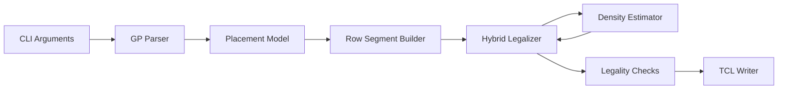

# High-Level Design

## Overview

This project implements a Linux C++17 placement legalizer for Programming Assignment #3, "Placement with OpenROAD." The executable reads the `.gp` file generated by the provided OpenROAD extraction flow, legalizes all movable `CELL` instances onto legal site rows while avoiding fixed `MACRO` and `BLOCKAGE` rectangles, and writes an OpenROAD TCL script containing one direct `place_cell` command per movable cell.

Legality is the primary requirement. After legality is achieved, the design optimizes the assignment quality metric:

```text
Quality = alpha * Average Displacement + (1 - alpha) * DOR
```

DOR is the percentage of non-macro 10 micron by 10 micron grids whose density exceeds the command-line `threshold`. The architecture therefore combines a legality-first row legalizer with density-aware scoring and a bounded smoothing pass.

## Goals

- Build a deterministic `Legalizer` executable with the required command line:

  ```sh
  ./Legalizer <alpha> <threshold> <input>.gp <output>.tcl
  ```

- Parse the assignment `.gp` format exactly, including DBU metadata, die area, site dimensions, movable cells, macros, and blockages.
- Place every movable `CELL` inside the die, aligned to site rows and legal site X coordinates.
- Prevent overlap among movable cells and between movable cells and fixed `MACRO` or `BLOCKAGE` rectangles.
- Preserve original cell orientation by emitting `-orient R0` for every output placement.
- Avoid calling OpenROAD `detailed_placement` in generated output.
- Optimize displacement and density overflow after legality is satisfied.
- Keep runtime below the 30 minute grading timeout per benchmark.

## Non-Goals

- The generated TCL will not invoke OpenROAD detailed placement.
- The legalizer will not rotate, flip, or otherwise change cell orientation.
- The design will not enforce multi-row power-rail compatibility because the assignment `.gp` format does not expose rail phase, legal orientation, or compatible row metadata.
- The design will not require netlist or timing data; the proposal and assignment input expose geometry only.
- Detailed placement transformations such as pair swapping, pin-aware optimization, and wirelength-driven reordering are outside this HLD unless later requirements add the needed data.

## Requirements Summary

| Area | Requirement |
| --- | --- |
| Platform | Linux C++17 program built by `make` |
| CLI | `Legalizer <alpha> <threshold> <input_file> <output_file>` |
| Input | `.gp` records with `DBU_Per_Micron`, die area, site dimensions, and `Name LLX LLY Width Height Type` rows |
| Movable objects | Records with type `CELL` |
| Fixed obstacles | Records with type `MACRO` or `BLOCKAGE` |
| Geometry | Internal coordinates use DBU integers |
| Output | OpenROAD TCL `place_cell -inst_name <instName> -orient R0 -origin {X Y}` |
| Output units | Origins converted from DBU to microns |
| Legality | In-die, non-overlapping, row/site aligned, fixed obstacle avoiding |
| Density | 10 micron by 10 micron grid, threshold from CLI |
| Runtime | Must complete each benchmark within 30 minutes |

## Proposed Architecture

The legalizer is organized as a small pipeline:



The parser builds a geometry model from the `.gp` file. The row segment builder derives legal placement capacity by subtracting fixed obstacles from site rows. The hybrid legalizer assigns movable cells to row segments using Abacus-style row optimization for the common single-row case, with a geometric multi-row fallback for cells taller than `Site_Height`. A density estimator guides insertion scoring and later smoothing. The writer emits only legal final placements as TCL.

## Modules

| Module | Responsibility | Inputs | Outputs | Owned Data | Dependencies |
| --- | --- | --- | --- | --- | --- |
| CLI and Configuration | Validate command-line arguments and hold `alpha`, `threshold`, input path, and output path | `argv` | Runtime configuration | Parsed scalar options | GP Parser, Legalizer, TCL Writer |
| Placement Model | Represent die, site grid, cells, fixed obstacles, rectangles, rows, and placements in DBU | Parsed records | Shared in-memory model | Instances, rectangles, original and legal positions | Geometry helpers |
| GP Parser | Read the assignment `.gp` file and classify records | Input file | Placement model records | Parse diagnostics | Placement Model |
| Row Segment Builder | Create legal site rows and free X segments after obstacle subtraction | Die area, site dimensions, fixed obstacles | Per-row legal segments | Segment lists, row coordinates | Placement Model |
| Abacus Row Engine | Repack a row or segment while preserving X order and minimizing movement | Ordered row cells plus candidate insertion | Trial or committed row placement | Clusters and row cell order | Row Segment Builder |
| Multi-Row Placement Layer | Place cells whose height exceeds one site row by finding feasible consecutive row spans and common X intervals | Tall cells, row segments, local region state | Legal placement or failure for a tall cell | Local insertion candidates | Row Segment Builder, Abacus Row Engine |
| Density Estimator | Estimate 10 micron grid occupancy and overflow impact | Fixed obstacles, current movable placements, candidate moves | Density penalties and DOR estimate | Grid occupancy counters | Placement Model |
| Hybrid Legalizer | Orchestrate deterministic trials, candidate search, scoring, commits, smoothing, and fallback behavior | Model, row segments, `alpha`, `threshold` | Final legal placement for every movable cell | Trial state and best solution | Abacus Row Engine, Multi-Row Placement Layer, Density Estimator |
| Legality Checker | Validate final placement before output | Final model | Pass/fail diagnostics | None beyond temporary checks | Placement Model, Row Segment Builder |
| TCL Writer | Emit one `place_cell` command per movable input cell | Final placements, DBU per micron | Output TCL file | Output ordering | Placement Model |
| Tests and Bench Harness | Exercise parser, geometry, row construction, legalizer behavior, and output format | Fixtures and public benchmarks | Test results | Test fixtures | All implementation modules |

## Module Relationships

- CLI and Configuration calls the GP Parser, constructs the runtime configuration, and starts the pipeline.
- GP Parser populates the Placement Model and preserves input order for deterministic TCL output.
- Row Segment Builder reads the Placement Model and produces free row segments consumed by the legalizer.
- Hybrid Legalizer owns the placement process and calls the Abacus Row Engine for trial and final row packing.
- Hybrid Legalizer calls the Multi-Row Placement Layer only for movable cells with `height > Site_Height`.
- Density Estimator is queried during candidate scoring and updated after committed placements.
- Density Smoothing reuses Hybrid Legalizer candidate evaluation to relocate selected cells from overflow grids.
- Legality Checker validates the completed Placement Model before TCL Writer emits output.
- TCL Writer depends on final legal coordinates and `DBU_Per_Micron` for micron conversion.

## Data Flow

1. Read `alpha`, `threshold`, input path, and output path from the command line.
2. Parse `.gp` metadata and instance records into DBU-based geometry.
3. Split instances into movable cells and fixed obstacles.
4. Build site rows from `DieArea_LL`, `DieArea_UR`, and `Site_Height`.
5. Subtract fixed obstacle rectangles from rows and snap free segment boundaries inward to legal site coordinates.
6. Run deterministic legalization trials:
   - order cells by increasing X, decreasing X, and optional large-cell priority;
   - enumerate candidate rows or row spans near each original Y;
   - evaluate candidate insertion using displacement and density impact;
   - commit the best legal candidate.
7. Select the best completed trial by assignment-like quality estimate.
8. Run a bounded density smoothing pass over the selected legal placement.
9. Re-check legality.
10. Write final placements as OpenROAD TCL.

## Interfaces and Contracts

### Command Line

```sh
./Legalizer <alpha> <threshold> <input_file> <output_file>
```

- `alpha` is the weight for average displacement.
- `threshold` is the density threshold used for DOR-sensitive scoring.
- `input_file` is the `.gp` file generated by `extract.tcl`.
- `output_file` is the TCL script to generate.

### Input Contract

The parser expects the assignment fields:

```text
DBU_Per_Micron <int>
DieArea_LL <x> <y>
DieArea_UR <x> <y>
Site_Width <int>
Site_Height <int>

Name LLX LLY Width Height Type
<name> <llx> <lly> <width> <height> <CELL|MACRO|BLOCKAGE>
```

All geometry is stored as half-open rectangles in DBU:

```text
[x_min, x_max) x [y_min, y_max)
```

### Output Contract

For each movable `CELL`, emit:

```tcl
place_cell -inst_name <instName> -orient R0 -origin {X Y}
```

`X` and `Y` are lower-left coordinates in microns. Output order follows movable cell input order unless testing proves another deterministic order is required.

### Row Segment Contract

A row segment is a horizontal, site-aligned free interval on one legal row. Segment boundaries are clipped to the die and snapped inward so every placement origin is site-aligned and contained in the segment.

### Abacus Row Contract

For a row or segment, the Abacus engine preserves the cells' original X order, clusters overlapping cells, computes each cluster's optimal X from weighted original positions, clamps clusters to segment bounds, and recursively collapses overlapping clusters. Trial calls must not mutate committed placement state.

### Density Contract

The density estimator uses:

```text
grid_size_dbu = 10 * DBU_Per_Micron
```

It tracks movable occupied area per grid and estimates overflow relative to `threshold`. Fixed macro regions are excluded from DOR accounting when enough geometric coverage information is available from the input obstacles.

## Operational Considerations

- Determinism matters for debugging and grading comparisons. Trial ordering, tie-breaking, and output order should be stable.
- DBU integer arithmetic should be used for legality-sensitive geometry. Floating point should be limited to scoring and output conversion.
- Candidate row search should begin near the original Y and stop when vertical displacement lower bounds exceed the best known candidate cost.
- Candidate row-span search for multi-row cells should require enough common X capacity across all covered rows.
- The smoothing pass must be bounded by time, iteration count, or no-improvement count so it cannot threaten the 30 minute timeout.
- The generated TCL must be easy to inspect and must not contain prohibited detailed placement commands.
- Public benchmark validation should use `flow.tcl` for OpenROAD legality, heatmap DOR, displacement, and final quality.

## Risks and Tradeoffs

- Density optimization can increase displacement. The scorer should scale displacement and DOR terms consistently with `flow.tcl` so low-`alpha` runs improve density without causing avoidable movement.
- A pure Abacus implementation optimizes displacement but not DOR. The density estimator and smoothing pass address the assignment-specific metric at the cost of additional runtime.
- Multi-row legal placement is under-specified by the `.gp` format because rail phase and legal orientation are unavailable. The design treats multi-row support as geometric row-span legality with `R0` orientation.
- Fixed macro exclusion from DOR depends on interpreting obstacle coverage over 10 micron grids. The estimator can approximate during optimization, but final scoring should be trusted to OpenROAD's heatmap from `flow.tcl`.
- Very fragmented rows near macros and blockages may reduce candidate capacity. Segment construction and candidate search must handle empty or narrow segments explicitly.

## Validation Plan

Build:

```sh
make
```

Run:

```sh
./Legalizer <alpha> <threshold> <designName>_insts.gp <designName>_insts.tcl
```

Use the provided OpenROAD flow to verify:

- `check_placement -verbose` passes;
- every movable cell is inside the die;
- every movable cell is aligned to legal site coordinates;
- movable cells do not overlap each other;
- movable cells do not overlap fixed macros or blockages;
- output contains one `place_cell` command per movable `CELL`;
- all output orientations are `R0`;
- output does not contain `detailed_placement`;
- runtime stays below 30 minutes per benchmark;
- average displacement, DOR, and final quality are recorded for both displacement-heavy and density-heavy parameter sets.

Unit and integration tests should cover:

- `.gp` parser metadata and record classification;
- DBU rectangle and half-open overlap behavior;
- fixed obstacle subtraction from rows;
- site snapping at segment boundaries;
- Abacus cluster collapse and segment clamping;
- multi-row candidate row-span feasibility;
- density grid occupancy and overflow estimation;
- TCL writer unit conversion and output format.

## Open Questions

- Public and hidden `.gp` files may or may not contain movable cells taller than `Site_Height`. The implementation should detect and log this; the HLD keeps geometric multi-row support because the proposal explicitly calls for it.
- The exact displacement normalization used for candidate scoring is implementation tuning. `flow.tcl` uses `norm_factor 18.2`; the implementation should expose this as a local constant or tuning value and validate it against public benchmark scores.
