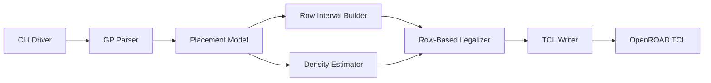

# High-Level Design

## Overview

This project implements a Linux C++17 placement legalizer for Programming Assignment #3, "Placement with OpenROAD." The executable reads an OpenROAD-extracted `.gp` placement file, legalizes movable standard cells, and writes an OpenROAD TCL placement script containing one `place_cell` command per movable cell.

The design follows the assignment evaluation flow in `flow.tcl`: OpenROAD performs global placement, `extract.tcl` writes the `.gp` file, `make` builds the project, `./Legalizer <alpha> <threshold> <input>.gp <output>.tcl` writes placement commands, OpenROAD sources the TCL, `check_placement -verbose` verifies legality, and the script computes displacement and DOR.

## Goals

- Produce a root-level `Legalizer` executable through `make`.
- Parse the assignment `.gp` format produced by `extract.tcl`.
- Legalize every movable `CELL` instance within the die.
- Align every movable cell to legal site-row coordinates.
- Avoid overlaps among movable cells and against fixed `MACRO` and `BLOCKAGE` entries.
- Preserve cell orientation by emitting `-orient R0`.
- Optimize the assignment quality metric using `alpha` and `threshold`:

```text
Quality = alpha * Average Displacement + (1 - alpha) * DOR
```

- Complete each benchmark run within the assignment's 30-minute timeout.

## Non-Goals

- The output TCL will not invoke OpenROAD `detailed_placement`.
- The legalizer will not rotate cells.
- The legalizer will not modify LEF, DEF, or OpenROAD database state directly.
- The density estimator is not required to reproduce OpenROAD GUI heatmap internals exactly; it is used as a placement guide.

## Requirements Summary

| Area | Requirement |
| --- | --- |
| Build | `make` must build `./Legalizer` in the repository root. |
| CLI | The executable must accept `Legalizer <alpha> <threshold> <input_file> <output_file>`. |
| Input | The parser must read `DBU_Per_Micron`, die lower-left and upper-right coordinates, site width, site height, and instance rows with `Name LLX LLY Width Height Type`. |
| Instance Types | `CELL` entries are movable. `MACRO` and `BLOCKAGE` entries are fixed obstacles. |
| Legal Placement | Movable cells must remain inside the die, be site-aligned, and avoid overlaps. |
| Output | The writer must emit OpenROAD TCL `place_cell -inst_name <name> -orient R0 -origin {X Y}` commands. |
| Units | Internal coordinates are DBU. Output origins are converted to microns using `DBU_Per_Micron`. |
| Quality | Placement should trade off average displacement and density overflow according to `alpha` and `threshold`. |

## Proposed Architecture

The legalizer is organized as a single command-line program with small modules for parsing, shared placement data, fixed-obstacle preprocessing, legalization, density estimation, and TCL output.



The CLI driver owns the lifecycle. The parser creates the in-memory design model. The row interval builder converts die and obstacle geometry into legal row capacity. The legalizer places cells into those row intervals using a displacement and density-aware score. The writer serializes only movable-cell placements into assignment-compatible TCL.

## Modules

| Module | Responsibility | Inputs | Outputs | Dependencies |
| --- | --- | --- | --- | --- |
| CLI Driver | Validate arguments, parse numeric parameters, orchestrate parse-legalize-write flow, and report fatal errors. | `alpha`, `threshold`, input path, output path. | Process exit status and output TCL file. | Parser, legalizer, writer. |
| GP Parser | Read the assignment `.gp` file and build a typed placement model. | Input file text. | Design metadata, movable cells, fixed obstacles. | Placement model. |
| Placement Model | Store DBU units, die area, site dimensions, instances, rectangles, and final placement coordinates. | Parsed input records. | Shared typed data for all modules. | None beyond standard C++ containers. |
| Row Interval Builder | Generate legal row intervals by snapping die rows and subtracting fixed macro/blockage spans. | Die area, site dimensions, fixed obstacles. | Per-row usable X intervals. | Placement model geometry. |
| Legalizer | Assign movable cells to legal site-aligned positions with no overlaps. | Movable cells, row intervals, `alpha`, `threshold`, density state. | Final coordinates for movable cells. | Row interval builder, density estimator. |
| Density Estimator | Track approximate 10 micron by 10 micron occupied density and score candidate placements. | Cell rectangles, fixed macro rectangles, threshold, DBU scale. | Candidate density penalty and updated occupancy. | Placement model geometry. |
| TCL Writer | Emit OpenROAD `place_cell` commands for legalized movable cells. | Final movable-cell placements and DBU scale. | Output `.tcl` file. | Placement model. |
| Test Fixtures | Validate parser behavior, interval construction, overlap checks, unit conversion, and simple legalization cases. | Small `.gp` fixture files or in-memory models. | Test pass/fail status through `make test`. | Public module APIs. |

## Module Relationships

- The CLI driver calls the parser once, then passes the resulting placement model through legalization and output.
- The parser owns input interpretation only; it does not decide legal positions.
- The placement model is the shared data contract between modules. Geometry remains in DBU until output serialization.
- The row interval builder depends on fixed obstacles and site dimensions. It provides legal horizontal capacity by row to the legalizer.
- The legalizer owns movable-cell assignment and must update both row occupancy and density occupancy as placements are committed.
- The density estimator informs candidate scoring, but the legalizer remains responsible for legality.
- The TCL writer depends on final legalized positions and performs DBU-to-micron conversion at the boundary to OpenROAD.

## Data Flow

1. `extract.tcl` produces `<designName>_insts.gp` from OpenROAD after global placement.
2. The CLI driver reads `alpha`, `threshold`, input path, and output path.
3. The parser loads design constants and instance records from the `.gp` file.
4. The placement model classifies records:
   - `CELL` as movable standard cells.
   - `MACRO` and `BLOCKAGE` as fixed obstacles.
5. The row interval builder creates legal row intervals from die bounds and removes fixed-obstacle spans.
6. The legalizer processes movable cells, searches candidate rows and X slots near each global-placement coordinate, scores candidates, and commits legal placements.
7. The density estimator updates approximate 10 micron grid occupancy after each committed placement.
8. The TCL writer emits one `place_cell` command per movable cell in micron coordinates.
9. `flow.tcl` sources the generated TCL and uses OpenROAD to check placement legality and compute quality metrics.

## Interfaces and Contracts

### Command Line

```text
./Legalizer <alpha> <threshold> <input_file> <output_file>
```

- `alpha` is parsed as a floating-point quality weight.
- `threshold` is parsed as the density overflow threshold used during candidate scoring.
- Invalid argument count, unreadable input, unwritable output, or impossible legalization should return a non-zero exit code.

### GP Input Contract

```text
DBU_Per_Micron <integer>
DieArea_LL <x> <y>
DieArea_UR <x> <y>
Site_Width <integer>
Site_Height <integer>

Name LLX LLY Width Height Type
<instName> <lowerleftX> <lowerleftY> <cellWidth> <cellHeight> <cellType>
```

The design treats coordinates, widths, and heights as DBU integers. The expected cell types are `CELL`, `MACRO`, and `BLOCKAGE`.

### TCL Output Contract

```tcl
place_cell -inst_name <instName> -orient R0 -origin {X Y}
```

`X` and `Y` are lower-left origins in microns. The writer emits commands only for movable `CELL` instances.

## Legalization Strategy

The first implementation uses row-based candidate search because the assignment's legality constraints are site-row based and the input exposes die and site dimensions directly.

For each movable cell, the legalizer:

1. Snaps candidate Y positions to legal rows near the original Y coordinate.
2. Searches legal row intervals for site-aligned X positions near the original X coordinate.
3. Rejects candidates that fall outside the die or overlap already placed cells, macros, or blockages.
4. Scores feasible candidates using a combination of displacement and density penalty.
5. Commits the best candidate and updates row occupancy and density state.

Cells may be ordered to improve quality and feasibility, such as by row proximity, size, or congestion pressure, as long as all final placements satisfy the assignment legality rules.

## Density Strategy

The density estimator uses 10 micron by 10 micron grids, matching the assignment's DOR definition. It tracks approximate occupied area from movable cells and excludes fixed-macro-covered regions from overflow accounting where practical. During candidate scoring, placements that would push grids above `threshold` receive a higher penalty.

This module is advisory: it helps reduce DOR, while OpenROAD's heatmap in `flow.tcl` remains the authoritative grading calculation.

## Operational Considerations

- Runtime must stay below 30 minutes per test case.
- Memory usage should scale with the number of cells, rows, intervals, and density grids in the public and hidden benchmarks.
- Parsing and output errors should be explicit because the TA flow runs the executable through `exec timeout 30m`.
- The final submission must include source code and a Makefile in the required student-ID folder.

## Risks and Tradeoffs

| Risk | Impact | Mitigation |
| --- | --- | --- |
| Greedy placement can trap later cells with few legal slots. | Legalization failure or excessive displacement. | Place harder cells earlier and support fallback expansion across more rows. |
| Approximate density scoring can differ from OpenROAD heatmap DOR. | Quality may be lower than expected. | Use the estimator only as a guide and validate with `flow.tcl`. |
| Fixed obstacles can partially overlap rows and sites. | Incorrect usable intervals can cause legality failures. | Build row intervals in DBU and subtract obstacle spans conservatively. |
| Unit conversion mistakes can place cells incorrectly in OpenROAD. | Legality failure or inflated displacement. | Keep all internal geometry in DBU and convert only in the writer. |
| Hidden benchmarks may have different die sizes, row counts, or congestion patterns. | Poor robustness. | Avoid benchmark-specific constants except the assignment-defined 10 micron density grid. |

## Open Questions

None. The proposal and assignment PDF define the required behavior, module boundaries, and evaluation flow for this high-level design.
