# High-Level Design

## Overview

This project implements `Legalizer`, a Linux command-line placement legalizer for Programming Assignment #3, "Placement with OpenROAD." The program reads an OpenROAD-extracted `.gp` file, legalizes movable standard-cell locations onto the site-row grid, avoids fixed macros, blockages, and previously placed cells, then emits an OpenROAD TCL script containing `place_cell` commands for movable cells only.

The design prioritizes legality first. Quality improvement is handled as a secondary objective using the assignment metric:

```text
Quality = alpha * Average Displacement + (1 - alpha) * DOR
```

where DOR is the percentage of non-macro 10um x 10um density-grid bins whose utilization exceeds the supplied threshold.

## Goals

- Build a `make`-driven C++ executable named `Legalizer`.
- Support the required command shape:

```sh
./Legalizer <alpha> <threshold> <input>.gp <output>.tcl
```

- Parse DBU, die bounds, site dimensions, movable cells, macros, and blockages from the `.gp` input.
- Move every `CELL` instance to a legal origin inside the die area.
- Align every placed cell to site rows and site columns.
- Prevent overlaps between movable cells, fixed macros, and blockages.
- Preserve fixed `MACRO` and `BLOCKAGE` objects as obstacles.
- Emit one `place_cell -inst_name <name> -orient R0 -origin {X Y}` command per movable cell.
- Use microns in output coordinates by converting DBU through `DBU_Per_Micron`.
- Improve placement quality through displacement-aware placement, density-aware placement, and local refinement.
- Complete each test case within the 30-minute assignment limit.

## Non-Goals

- The generated TCL must not invoke `detailed_placement`.
- Cell rotation is not supported; all output commands use `-orient R0`.
- The program does not modify LEF, DEF, OpenROAD database state, or benchmark files directly.
- The program does not emit placement commands for macros or blockages.
- The legalizer does not need to reproduce OpenROAD detailed placement behavior; OpenROAD detailed placement is only a debugging baseline.

## Requirements Summary

| Area | Requirement |
| --- | --- |
| Input | Read `DBU_Per_Micron`, `DieArea_LL`, `DieArea_UR`, `Site_Width`, `Site_Height`, and records with `Name LLX LLY Width Height Type`. |
| Movable objects | Only records with type `CELL` are movable. |
| Fixed objects | Records with type `MACRO` or `BLOCKAGE` are fixed obstacles. |
| Legality | Cells must be inside the die, aligned to site rows, aligned to site columns, and non-overlapping. |
| Output | Write OpenROAD TCL `place_cell` commands with origins in microns. |
| Scoring | Optimize weighted quality using average displacement and DOR. |
| Runtime | Avoid algorithms that risk exceeding 30 minutes on public or hidden benchmarks. |
| Validation | Use OpenROAD `check_placement -verbose` as legality source of truth. |

## Proposed Architecture

The legalizer is organized as a batch pipeline:

```mermaid
flowchart LR
    CLI["CLI Arguments"] --> Parser["GP Parser"]
    Parser --> Model["Placement Data Model"]
    Model --> Rows["Row and Obstacle Model"]
    Rows --> Density["Density Grid Model"]
    Density --> Engine["Legalization Engine"]
    Engine --> Refine["Local Refinement"]
    Refine --> Writer["TCL Writer"]
    Writer --> Output["Output .tcl"]
```



The pipeline keeps parsing, geometric legality, density scoring, legalization, refinement, and output formatting separate. This separation keeps legality checks independent from quality heuristics, which is important because a lower quality score is useful only after placement legality is guaranteed.

## Modules

| Module | Responsibility | Inputs | Outputs | Owned Data | Dependencies |
| --- | --- | --- | --- | --- | --- |
| CLI and Configuration | Validate command-line arguments and store `alpha`, `threshold`, input path, and output path. | `argc`, `argv` | Configuration object | Runtime options | None |
| GP Parser | Read the `.gp` format and build typed placement objects. | Input `.gp` file | Parsed design data | Raw records, DBU, die bounds, site dimensions | File I/O |
| Placement Data Model | Represent cells, fixed obstacles, rectangles, rows, intervals, and coordinates. | Parsed design data | Shared in-memory model | Cell list, obstacle list, original positions | Parser |
| Row and Obstacle Model | Derive legal rows and free intervals by subtracting macro and blockage coverage. | Die bounds, site dimensions, fixed obstacles | Row free-space structure | Row intervals, row occupancy | Placement Data Model |
| Density Grid Model | Estimate 10um x 10um density-grid pressure and DOR-related costs during placement. | Die bounds, DBU, threshold, fixed macros, placed cells | Density cost and overflow estimates | Grid bins, macro-excluded bins, cell occupancy estimate | Placement Data Model |
| Legalization Engine | Assign each movable cell to a legal row/site location without overlap. | Cells, row free intervals, density model, `alpha` | Initial legal placement | Current cell positions, occupied row intervals | Row and Obstacle Model, Density Grid Model |
| Local Refinement | Improve displacement and density while preserving legality. | Initial legal placement | Refined legal placement | Candidate moves, swap/shift decisions | Legalization Engine |
| TCL Writer | Emit OpenROAD placement commands in the required format. | Final cell placements, DBU | Output `.tcl` file | None beyond output stream | Placement Data Model |
| Validation Helpers | Provide internal checks for alignment, bounds, and overlap before writing. | Final placement | Pass/fail diagnostics | Temporary check state | Placement Data Model, Row and Obstacle Model |

## Module Relationships

- The CLI module owns runtime parameters and passes them to parser, density, legalization, and writer stages.
- The GP Parser creates the Placement Data Model but does not decide legal positions.
- The Row and Obstacle Model consumes fixed obstacles and produces the geometric legal space used by the Legalization Engine.
- The Density Grid Model observes placed-cell updates from the Legalization Engine and returns density-pressure costs for candidate locations.
- The Legalization Engine owns placement decisions and updates both row occupancy and density state as cells are committed.
- The Local Refinement module operates after an initial legal placement exists and may request trial moves or swaps through the same legality checks used by the Legalization Engine.
- The TCL Writer is terminal in the pipeline and should receive only validated final cell origins.

## Data Flow

1. Read command-line arguments and validate that four user parameters are present.
2. Parse the `.gp` file into design metadata, movable cells, and fixed obstacles.
3. Derive row indices from `DieArea_LL.y`, `DieArea_UR.y`, and `Site_Height`.
4. For each row, subtract intersecting macro and blockage rectangles to produce site-aligned free intervals.
5. Sort movable cells deterministically using original global-placement position and stable tie-breakers.
6. For each cell, search nearby rows and candidate free slots around the original location.
7. Score candidate slots using displacement cost and density pressure, weighted by `alpha`.
8. Commit the best legal candidate, update row occupancy, and update density-grid occupancy.
9. Run bounded local refinement passes that preserve row/site alignment and non-overlap.
10. Validate the final placement internally.
11. Write `place_cell` commands for all movable cells.

## Interfaces and Contracts

### Command-Line Interface

```sh
./Legalizer <alpha> <threshold> <input_file> <output_file>
```

- `alpha` is parsed as a floating-point weight.
- `threshold` is parsed as a floating-point density threshold.
- `input_file` is the OpenROAD-extracted `.gp` path.
- `output_file` is the generated TCL path.

### Input File Contract

The parser expects the assignment format:

```text
DBU_Per_Micron <integer>
DieArea_LL <x> <y>
DieArea_UR <x> <y>
Site_Width <integer>
Site_Height <integer>

Name LLX LLY Width Height Type
<instName> <lowerleftX> <lowerleftY> <width> <height> <CELL|MACRO|BLOCKAGE>
```

Coordinates and dimensions are DBU. The parser should reject missing required metadata, malformed numeric fields, non-positive site dimensions, and unknown object types.

### Output File Contract

The writer emits one command per movable cell:

```tcl
place_cell -inst_name <instName> -orient R0 -origin {<xMicron> <yMicron>}
```

The output must not contain `detailed_placement`. Macro and blockage records are never emitted.

### Legality Contract

A cell placement is legal only if:

- `x` and `y` are inside the die.
- `x + width <= DieArea_UR.x` and `y + height <= DieArea_UR.y`.
- `x` is aligned to a legal site column.
- `y` is aligned to a legal site row.
- The cell rectangle does not overlap any fixed obstacle.
- The cell rectangle does not overlap any other movable cell.

## Operational Considerations

- Use integer DBU coordinates internally to avoid floating-point drift in legality decisions.
- Convert to microns only when writing TCL output.
- Keep placement deterministic so benchmark comparisons are reproducible.
- Prefer row-local interval operations over global pairwise overlap checks in the hot path.
- Bound candidate search radius and refinement passes so hidden cases remain within the 30-minute limit.
- Treat OpenROAD `check_placement -verbose` as the final legality oracle during validation.
- Use OpenROAD heatmap output from `flow.tcl` to validate final DOR, while using the internal density model only as a placement heuristic.

## Risks and Tradeoffs

| Risk | Impact | Mitigation |
| --- | --- | --- |
| Density estimate differs from OpenROAD heatmap | Internal DOR optimization may not match final scoring exactly. | Use density as a heuristic and validate/tune with `flow.tcl` heatmap output. |
| Greedy placement can trap wide or difficult cells | Later cells may be displaced heavily or fail to find nearby legal space. | Place harder cells earlier through width-aware and congestion-aware ordering; include bounded fallback search. |
| Hidden cases may be larger or denser than public cases | Expensive candidate enumeration can exceed runtime limit. | Cap search windows, use row intervals, and avoid full cell-pair overlap checks. |
| Macro/blockage interval snapping errors | Placement may appear legal internally but fail OpenROAD checks. | Keep all geometry in DBU and validate fixed-obstacle exclusion row by row. |
| Refinement can break legality if it bypasses core checks | Quality improvements may introduce overlaps. | Route every trial move/swap through the same legality and occupancy update path. |

## Open Questions

1. Student ID and final submission folder name are not specified yet.
2. The final internal quality formula for candidate scoring is still open: the proposal requires using `alpha` to balance displacement and density pressure, but it does not mandate an exact heuristic.
3. The number and type of refinement passes are still open. The proposal mentions local refinement, row-local compaction, and window-based swaps as options, but does not require all of them.
4. The internal DOR approximation details are still open because OpenROAD's heatmap is the final scoring source, while the assignment only specifies the 10um x 10um overflow-grid definition.
