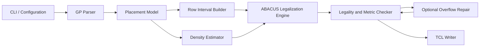

# High-Level Design

## Overview

This project implements a Linux C++17 command-line placement legalizer for Programming Assignment #3, "Placement with OpenROAD." The executable reads an OpenROAD-extracted `.gp` file, legalizes all movable `CELL` instances inside the die, avoids fixed `MACRO` and `BLOCKAGE` regions, aligns cells to site rows and site columns, and writes an OpenROAD TCL script with one `place_cell` command per movable cell.

The design follows the proposal's ABACUS-inspired approach: build legal row intervals, process cells by global x-order, trial-insert each cell into candidate row intervals, use cluster placement to minimize movement within a row, score candidates with displacement and density-overflow pressure, then emit a legal TCL placement.

Primary sources for this design are `doc/proposal.md`, `p3_placement.pdf`, `abacus.pdf`, `extract.tcl`, `flow.tcl`, `README.md`, and `Makefile`.

## Goals

- Build with `make` and expose the required interface:

```sh
./Legalizer <alpha> <threshold> <input.gp> <output.tcl>
```

- Parse assignment `.gp` input containing DBU, die bounds, site dimensions, and instance records.
- Place every movable `CELL` legally inside the die.
- Avoid overlap with other cells, `MACRO` instances, and `BLOCKAGE` regions.
- Snap all generated cell origins to legal site columns and site rows.
- Preserve cell orientation as `R0`.
- Optimize the assignment quality metric by balancing average displacement and density overflow ratio according to `alpha` and `threshold`.
- Finish each benchmark within the 30-minute assignment limit.
- Provide validation code and tests for parsing, interval construction, row placement, output formatting, legality, displacement, and DOR-related behavior.

## Non-Goals

- The final TCL output will not call OpenROAD `detailed_placement`; the assignment explicitly forbids this.
- The legalizer will not rotate cells.
- The base design does not attempt full detailed placement optimizations such as cell swaps, flips, or netlist-aware wirelength optimization because the proposal focuses on legalization and density-aware movement.
- The base implementation targets the standard single-row-height case stated in the proposal. Multi-row movable-cell handling remains an open risk unless confirmed or added explicitly.

## Requirements Summary

| Area | Requirement |
| --- | --- |
| Platform | Linux |
| Language | C++17 |
| Build | `make` creates `Legalizer` in the repository root |
| CLI | `Legalizer <alpha> <threshold> <input_file> <output_file>` |
| Input | `.gp` text with `DBU_Per_Micron`, `DieArea_LL`, `DieArea_UR`, `Site_Width`, `Site_Height`, blank line, header, and instance rows |
| Instance types | `CELL` is movable; `MACRO` and `BLOCKAGE` are fixed obstacles |
| Output | OpenROAD TCL `place_cell -inst_name <name> -orient R0 -origin {X Y}` |
| Coordinates | Internal geometry uses integer DBU; TCL output converts origin coordinates to microns |
| Legality | Cells inside die, row-aligned, site-aligned, non-overlapping, and not overlapping fixed obstacles |
| Quality | Lower `Quality = alpha * Average_Displacement + (1 - alpha) * DOR` is better |
| DOR | Percentage of 10um x 10um grids exceeding `threshold`, excluding grids occupied by fixed macros from the grid count |
| Forbidden output | No final-output `detailed_placement` command |

## Proposed Architecture

The legalizer is organized as a deterministic pipeline:



The parser owns input decoding only. The placement model owns normalized geometry and instance records. The row interval builder converts die rows and fixed obstacles into placeable row segments. The legalization engine owns placement decisions. The density estimator provides trial and final density feedback. The checker validates legal output and computes metrics for development. The writer emits assignment-compliant TCL.

## Modules

| Module | Responsibility | Inputs | Outputs | Owned Data | Dependencies |
| --- | --- | --- | --- | --- | --- |
| CLI / Configuration | Validate arguments, parse `alpha` and `threshold`, coordinate top-level flow, return success/failure status | `argc`, `argv` | Runtime configuration, selected input/output paths | `alpha`, `threshold`, file paths | Parser, engine, writer, checker |
| GP Parser | Parse assignment `.gp` files into typed records | Input file path | `PlacementModel` | None after parse | Placement model |
| Placement Model | Represent die, site grid, movable cells, fixed obstacles, original and legal positions | Parser output | Shared geometry and instance data | Die bounds, DBU, site dimensions, cells, obstacles | None |
| Row Interval Builder | Build legal row intervals by subtracting macros and blockages from each site row | Placement model | Row intervals / subrows | Row interval list, row-index mapping | Placement model |
| Row Placement / Cluster Solver | Implement ABACUS `PlaceRow` for one interval in trial and final modes | Ordered cells in an interval, candidate inserted cell | Legal x positions for interval cells, movement delta | Temporary clusters, row cell order | Placement model |
| Legalization Engine | Sort cells, search candidate rows, run row trials, select final placement, optionally run both x-order directions | Placement model, row intervals, configuration, density estimator | Legal cell positions | Row state, candidate scores, best solution snapshot | Row placement, density estimator |
| Density Estimator | Estimate density impact during row trials and compute final DOR | Cell rectangles, DBU, threshold, fixed macro regions | Density penalty, DOR | 10um grid/bin occupancy and exclusion metadata | Placement model |
| Legality and Metric Checker | Verify final placement and compute development metrics | Placement model with legal positions | Pass/fail diagnostics, average displacement, DOR | Temporary occupancy structures | Density estimator |
| TCL Writer | Emit one OpenROAD `place_cell` command per movable cell | Placement model with legal positions, output path | `.tcl` output file | None | Placement model |
| Tests | Validate units and smoke-test public-style flows | Fixtures, module APIs | Test executable result | Fixture data | All core modules |

## Module Relationships

- CLI calls the parser first because all later modules depend on normalized input geometry.
- GP Parser populates Placement Model but does not perform legalization decisions.
- Row Interval Builder reads fixed obstacles from Placement Model and produces placeable intervals consumed by the Legalization Engine.
- Legalization Engine owns row state and calls the Row Placement / Cluster Solver repeatedly in reversible trial mode before committing a selected insertion.
- Density Estimator is consulted by the Legalization Engine during candidate scoring and by the checker after final placement.
- Legality and Metric Checker reads final positions from Placement Model and can gate TCL writing during development.
- TCL Writer is the final module and should only depend on validated final positions.

## Data Flow

1. Read CLI arguments and validate that `alpha` is numeric, `threshold` is numeric, and input/output paths are present.
2. Parse `.gp` into integer DBU geometry:
   - DBU per micron.
   - Die lower-left and upper-right.
   - Site width and site height.
   - Movable cells.
   - Fixed macros and blockages.
3. Normalize legal-grid helpers:
   - Row index from `(y - die_lly) / site_height`.
   - Site index from `(x - die_llx) / site_width`.
4. Construct legal row intervals:
   - Begin each row with the die x-span.
   - Subtract every overlapping macro/blockage x-span.
   - Snap interval starts and ends to site columns.
   - Drop intervals too small to contain a legal placement site.
5. Legalize movable cells:
   - Sort cells by original x-coordinate, with stable tie-breaking by y-coordinate and name.
   - For each cell, search candidate rows near its original y-coordinate.
   - For each row interval that can fit the cell, run reversible `PlaceRow`.
   - Score the candidate with displacement and density penalty.
   - Commit the best candidate by rerunning `PlaceRow` in final mode.
6. Optionally repeat with reverse x-order and keep the better legal solution.
7. Verify legality and compute metrics.
8. Optionally repair overflowed density regions using local row trials.
9. Convert final DBU origins to microns and write `place_cell` TCL commands.

## Interfaces and Contracts

### Command-Line Interface

```sh
./Legalizer <alpha> <threshold> <input.gp> <output.tcl>
```

`alpha` controls the displacement-vs-density scoring balance. `threshold` is the density overflow threshold used for DOR and density-aware trial scoring.

### GP Input Contract

The parser expects the assignment format:

```text
DBU_Per_Micron <int>
DieArea_LL <llx> <lly>
DieArea_UR <urx> <ury>
Site_Width <int>
Site_Height <int>

Name LLX LLY Width Height Type
<instName> <lowerleftX> <lowerleftY> <cellWidth> <cellHeight> <CELL|MACRO|BLOCKAGE>
```

All coordinates and dimensions are interpreted as integer DBU.

### TCL Output Contract

For each movable cell:

```tcl
place_cell -inst_name <instName> -orient R0 -origin {<x_micron> <y_micron>}
```

The output must not contain `detailed_placement`.

### Row Interval Contract

A row interval represents one contiguous legal x-span on one site row. It must satisfy:

- `y = die_lly + row_index * site_height`.
- Start and end are snapped to site columns.
- The interval is inside the die.
- The interval excludes x-spans of fixed obstacles that overlap the row.

### Row Placement Contract

`PlaceRow` receives an ordered list of cells assigned to one row interval and returns non-overlapping x origins within that interval while preserving order. Trial calls must be reversible and must not mutate committed state. Final calls update committed row state and cell legal positions.

### Density Contract

Density bins use 10um x 10um grid geometry converted to DBU using `DBU_Per_Micron`. DOR computation counts grids whose movable-cell density exceeds `threshold`, excluding fixed-macro-occupied grids from the denominator as required by the assignment.

## Operational Considerations

- Runtime must remain below 30 minutes per benchmark, so candidate-row search should stop when vertical displacement alone cannot beat the current best candidate.
- Row trial state should be copy-on-write or otherwise bounded to avoid expensive full-design copies for every candidate.
- Integer DBU arithmetic should be used for legality. Floating-point arithmetic should be limited to scoring, cluster weighted averages, and TCL micron formatting.
- The checker should fail loudly during development if the engine cannot produce a legal placement.
- The final output path should be written only after a valid placement is available, so failed legalization does not leave a misleading TCL script.
- Public benchmark smoke tests should exercise the exact assignment executable interface.

## Risks and Tradeoffs

- Density-aware scoring may conflict with minimal displacement. The design keeps displacement and density penalties separate so tuning can be done without changing legality logic.
- Exact DOR updates during every trial may be expensive. A row-bin approximation is acceptable for early candidate scoring, with exact DOR computed after full legalization.
- ABACUS preserves row order within an interval, which is efficient and movement-aware but may miss better placements requiring reordering.
- Reverse x-order legalization is cheap relative to implementation complexity and can improve quality, but it doubles the main legalization pass runtime.
- Multi-row-height movable cells are not fully specified by the assignment text or proposal. Detecting them is necessary to avoid silently emitting illegal placements.
- `flow.tcl` uses a debug path with OpenROAD `detailed_placement` for observation; the legalizer output must remain independent of that debug command.

## Open Questions

1. Do hidden benchmarks contain movable cells whose height is greater than one site row? The proposal says to target the standard single-row-height case but notes this as the main implementation item to confirm.
2. Should the final implementation optimize average displacement using Manhattan distance, Euclidean distance, or the assignment grader's internal interpretation? `flow.tcl` computes displacement using `abs(dx) + abs(dy)`, while the assignment PDF states average displacement without defining the distance norm.
3. Should fixed `BLOCKAGE` regions be excluded from DOR grid counts the same way fixed macros are? The assignment explicitly mentions excluding regions occupied by fixed macros; the proposal groups macros and blockages as fixed obstacles for legality.
